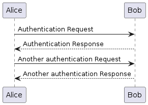

# nx-plantuml
Example of using nx and plantuml for automated image generations

Just run `npm run dev` and your project will start in a dev mode rebuilding artifacts on the fly.

this image below is generated from this [file](docs/puml/auth.puml)

